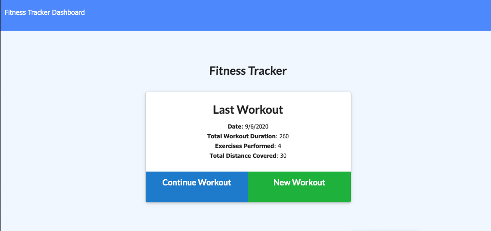
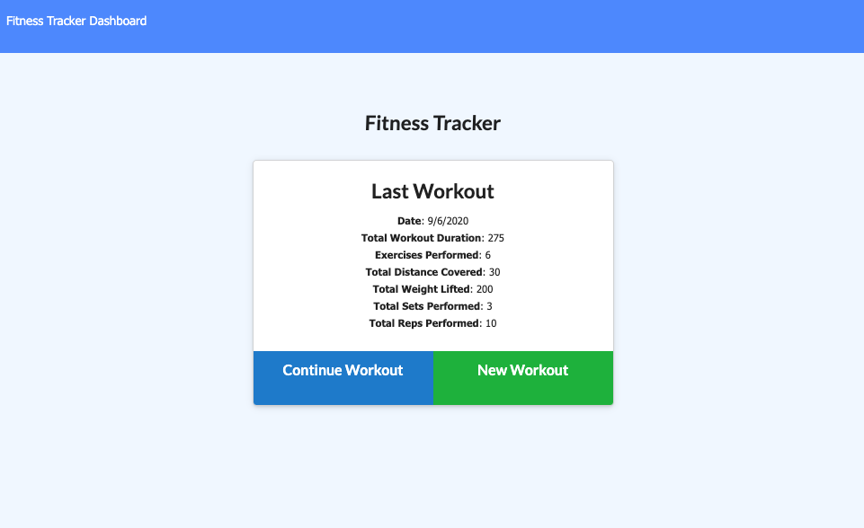
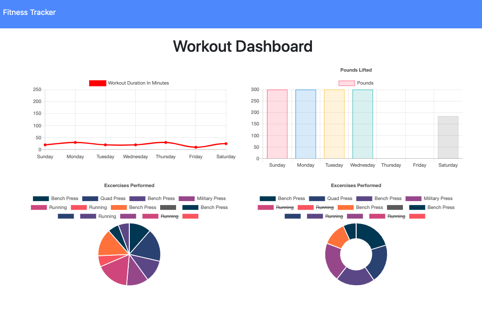

# Unit 17 Nosql Homework: Workout Tracker

## Description

This assignment was to create a fitness workout tracker using a Mongo database with a Mongoose schema. Routes needed to be handled with Express. All of the front end code was provided so the challenge here was make all of the connections and end up with a fully functioning application.

### Project Details

Here are some of the specific items required for my final application:

For the user, they should be able to view, create, and track daily workouts. They want to be able to log multiple exercises in a workout on a given day. They should be able to track the name, type, weight, sets, reps, and duration of exercise. If the exercise is a cardio exercise, they should be able to track the distance traveled. Keeping in mind that a consumer will reach their fitness goals quicker when they track their workout progress.

### Acceptance Criteria

When the user loads the page, they should be given the option to create a new workout, or continue with their last workout.

The user should be able to do all of the following things:

  - Add exercises to a previous workout plan.

  - Add new exercises to a new workout plan.

  - View multiple workouts combined weight and duration of multiple exercises on the `Dashboard` page.

### Results

The final application performs as expected and meets the requirements given above. 

### Images

- Tracker shows last workout logged 
 

- Tracker shows updated workout information 
 

- Workouut Dashboard 
 